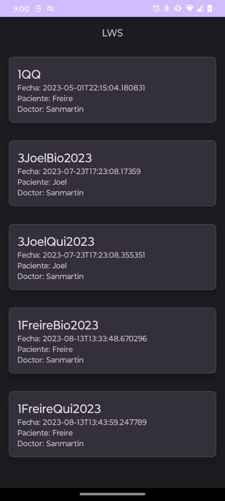

# Laboratory Web Services Móvil (LWS Móvil)

Aplicación basada en Android para gestionar examenes de Laboratorio Clínico

## Características

- UI utilizando elelmentos de Material Design 3
- Arquitectura MVVM
- Se implemento y se mapeo el proyecto enteramente con el uso de LWS API basada en Java con Springboot y con una base de datos(Vease Utilizar Demo de LWS API con LWS movil)
- Gestiona los examenes que esten disponbles y acceder a los datos pertinentes por medio 
- Usa un `BindingAdapter` para ver que valores estan fuera del rango del dato y los resalta en la pantalla de [Listado de Datos](#listado-de-datos)
- Habilitada funcionalidad para enviar reportes por medio de Whatsapp
- Snackbars para cuando existan errores al recuperar información de la API o cuando recupére, muestre la cantidad de datos de examenes o datos respectivamente de en que pantalla se encuentre

## Librerías

- Retrofit

```gradle
implementation 'com.squareup.retrofit2:retrofit:2.9.0'
```
- Kapt
```gradle
implementation("androidx.lifecycle:lifecycle-runtime-ktx:2.5.1")
```
- ViewModel
```gradle
implementation "androidx.lifecycle:lifecycle-viewmodel-ktx:2.5.1"
```
- LiveData
```gradle
implementation "androidx.lifecycle:lifecycle-livedata:2.5.1"
```
- Material Design 3
```gradle
implementation 'com.google.android.material:material:1.9.0'
```
- Corrutinas
```gradle
implementation "org.jetbrains.kotlinx:kotlinx-coroutines-android:1.5.0"
```

## Capturas

### Listado de Examenes


### Listado de Datos


### Cuadro de dialogo de Valores Referenciales


### Notificación Whatsapp 


## Utilizar Demo de LWS API con LWS movil
Diríjase a [Releases](https://github.com/driventub/LWS_movil/releases/tag/Alpha)